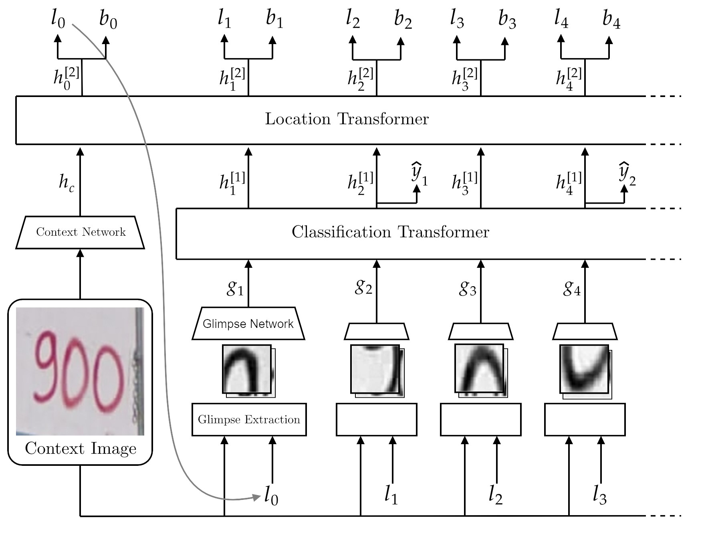
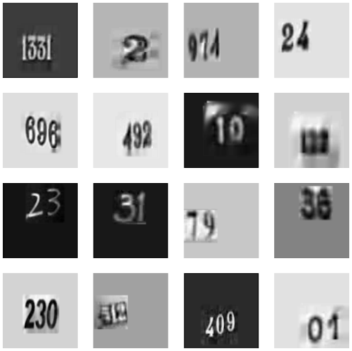
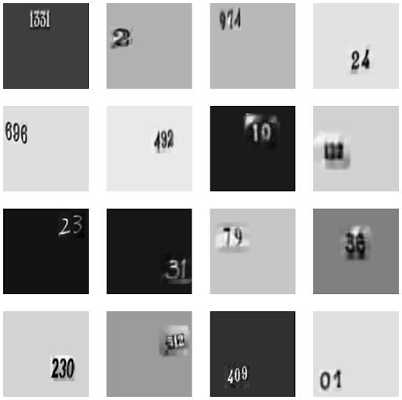
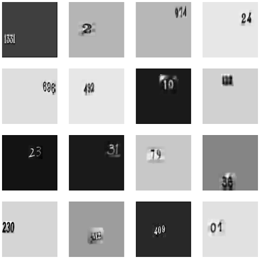
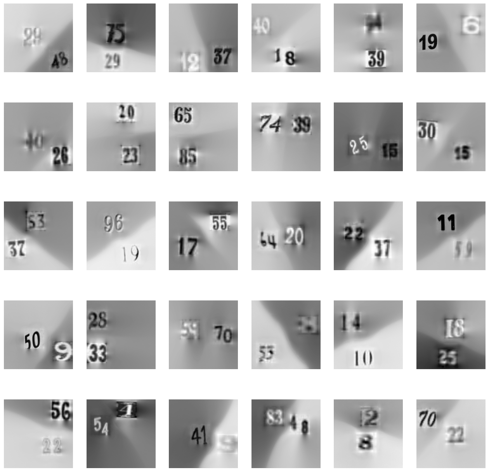

# Fixation-Guided Visual Attention Models with Transformers

### Implementation of the RAM [1] and DRAM [2] recurrent visual attention models, along with a modification that uses Transformers instead of RNNs/LSTMs as the core of the model.

<p align="center">
   
</p>

<p align="center">
    <i>DRAM model with Transformers as core.</i>
</p>

This repository is part of the final Master’s thesis in the Master of Computer Vision at Universitat Autónoma de Barcelona (UAB), with the participation of the Computer Vision Center (CVC), Universitat de Barcelona (UB), Universitat Pompeu Fabra (UPF), Universitat Politècnica de Catalunya (UPC), and Universitat Oberta de Catalunya (UOC).

We show how to run these models on the MNIST (single-digit classification) and SVHN (multiple-digit classification) datasets.

Additionally, we provide two extra tasks based on two synthetic datasets derived from SVHN:
- **SVHN with an extended background**: This task tests the model's localization capabilities. The images below show examples of 110x110, 186x186, and 224x224 synthetic images.

<p align="center">



</p>

- **SVHN with multiple numbers**: Sequences of digits per image.

<p align="center">

</p>

## Getting Started

1. **Clone the Repository**:
   ```bash
   git clone https://github.com/JordiMoralesCasas/transformer_dram_ram
   cd transformer_dram_ram
   ```


2. **Create virtual environment (CONDA)**:
    ```bash
    conda env create -n env_name

    conda activate env_name
    ```

3. **Intall required packages**:
   ```bash
   pip install -r requirements.txt
   ```

## Setting up the data

Instructions on how to set up the data for different experiments.

### MNIST dataset

All necessary data is already included in this repo. No additional steps are required.

### SVHN dataset

1. Download the SVHN dataset from the [official website](http://ufldl.stanford.edu/housenumbers/). All three splits from the `Format 1` section must be downloaded (*train.tar.gz*, *test.tat.gz*, *extra.tar.gz*).

2. Extract the three files into the same directory. The folder structure should look something like this:
   ```
    |____extra/
    |    |____1.png
    |    |   ...
    |    |____digitStruct.mat
    |    |____see_bboxes.m
    |
    |____test/
    |    |____1.png
    |    |   ...
    |    |____digitStruct.mat
    |    |____see_bboxes.m
    |
    |____train/
    |    |____1.png
    |    |   ...
    |    |____digitStruct.mat
    |    |____see_bboxes.m
   ```

### SVHN with Extended Background

No additional steps are required as the data is generated during runtime using the original SVHN dataset.

### SVHN with multiple numbers

To create the synthetic SVHN dataset with multiple numbers per sample, run the following script. Use the default values to match the configuration in our work. *DATA_DIR* refers to the directory created in the `SVHN dataset` subsection.

```
python3 data/svhn/create_multinumber_dataset.py --help
    usage: data/svhn/create_multinumber_dataset.py 
                    [--data_dir DATA_DIR] 
                    [--save_dir SAVE_DIR]
                    [--img_size IMG_SIZE]
                    [--bbox_size BBOX_SIZE]
                    [--train_split_size SPLIT]
                    [--dataset_length LENGTH]
                    [--num_workers N_WORKERS]

    options:
    -h, --help                   Show this help message and exit
    --data_dir DATA_DIR          Directory with the original SVHN dataset.
    --save_dir SAVE_DIR          Directory where the new dataset will be saved.
    --img_size IMG_SIZE          Size of the dataset samples (Square).
    --bbox_size BBOX_SIZE        Size of the resized number's bounding box 
                                 (Square).
    --train_split_size SPLIT     Portion of the whole dataset that is used for
                                 training. The remainder is split evenly for validation and test.
    --dataset_length LENGTH      Length of the new dataset.
    --num_workers N_WORKERS      Size of the pool of workers.
```
## Running examples

You can run all model configurations from the same script (*main.py*). Check *config.py* to better understand all available arguments and configurations.

Below are examples of how to run the models.

### Train and test RAM model on MNIST

Set `is_train` to `False` for inference on a pretrained. To use the original RAM model (RNN based), set the `core_type` argument to `rnn`, and ignore `transformer_model`.

Available Transformers: GTrxl (`gtrxl`), GPT2 (`gpt2`) and TrXL (`trxl`).

```
python main.py
   --is_train True \
   --epochs 10 \
   --core_type transformer \
   --transformer_model gtrxl \
   --task mnist \
   --ckpt_dir SOME_PATH
```

### Train and test DRAM model on SVHN

Set `is_train` to `False` for inference on a pretrained. To use the original DRAM model (LSTM based), set the `core_type` argument to `rnn`, and ignore `transformer_model`.

Available Transformers: GTrxl (`gtrxl`), GPT2 (`gpt2`) and TrXL (`trxl`).

```
python main.py
   --is_train False \
   --epochs 10 \
   --core_type transformer \
   --transformer_model gtrxl \
   --task svhn \
   --ckpt_dir SOME_PATH
```

### Train and test DRAM model on the Extended background task (SVHN)

Set `is_train` to `False` for inference on a pretrained. To use the original DRAM model (LSTM based), set the `core_type` argument to `rnn`, and ignore `transformer_model`.

Available Transformers: GTrxl (`gtrxl`), GPT2 (`gpt2`) and TrXL (`trxl`).

Argument `preprocess` refers to the size of the image after extending the background. Available sizes are `110`, `186` and `224`. For the `224` configuration, a ResNet50 model will be used as the context network.

The `snapshot` flag signals wether a 54x54 snapshot of the full image will be used as context. Set the `use_encoder` flag to True if you want to use a pretrained ViT model to provide the context information.


```
python main.py
   --is_train False \
   --epochs 10 \
   --core_type transformer \
   --transformer_model gtrxl \
   --task svhn \
   --preprocess 110 \
   --use_encoder False \
   --snapshot True \
   --ckpt_dir SOME_PATH
```

### Train and test DRAM model on Multiple Numbers task (SVHN)

Set `is_train` to `False` for inference on a pretrained. To use the original DRAM model (LSTM based), set the `core_type` argument to `rnn`, and ignore `transformer_model`.

Available Transformers: GTrxl (`gtrxl`), GPT2 (`gpt2`) and TrXL (`trxl`).

The `snapshot` flag signals wether a 54x54 snapshot of the full image will be used as context. Set the `use_encoder` flag to True if you want to use a pretrained ViT model to provide the context information.

```
python main.py
   --is_train False \
   --epochs 10 \
   --core_type transformer \
   --transformer_model gtrxl \
   --task multinumber \
   --use_encoder False \
   --snapshot True \
   --ckpt_dir SOME_PATH
```

### Gridsearch example (WandB required)

Perform gridsearch:

1. Follow the steps in `Integration with WandB` subsection.

2. Edit the sweep configuration dictionary in *gridsearch.py* to include the desired hyperparameters.

3. Run the following command: 
```
python gridsearch.py
```

## Integration with WandB
Log into WandB using the terminal and change the `wandb_entity` and `wandb_project` parameters in the configuration file (*config.py*). Then, use the flag `--wandb_name ANY_NAME` to log the experiment into WandB when running a model.

## Acknowledgements
This project has been built using @[kevinzakka](https://github.com/kevinzakka)'s excellent implementation of the RAM model as 
starting point: https://github.com/kevinzakka/recurrent-visual-attention

Special thanks to the GTrXL [3] model implementation by @[OpenDILab](https://github.com/opendilab), which has been of great help: https://github.com/opendilab/PPOxFamily/blob/main/chapter5_time/gtrxl.py

## References

[1] [Volodymyr Mnih et al. "Recurrent Models of Visual Attention"](https://arxiv.org/abs/1406.6247)

[2] [Jimmy Ba et al. "Multiple Object Recognition with Visual Attention"](https://arxiv.org/abs/1412.7755)

[3] [Emilio Parisotto et al. "Stabilizing Transformers for Reinforcement Learning"](https://arxiv.org/abs/1910.06764)
